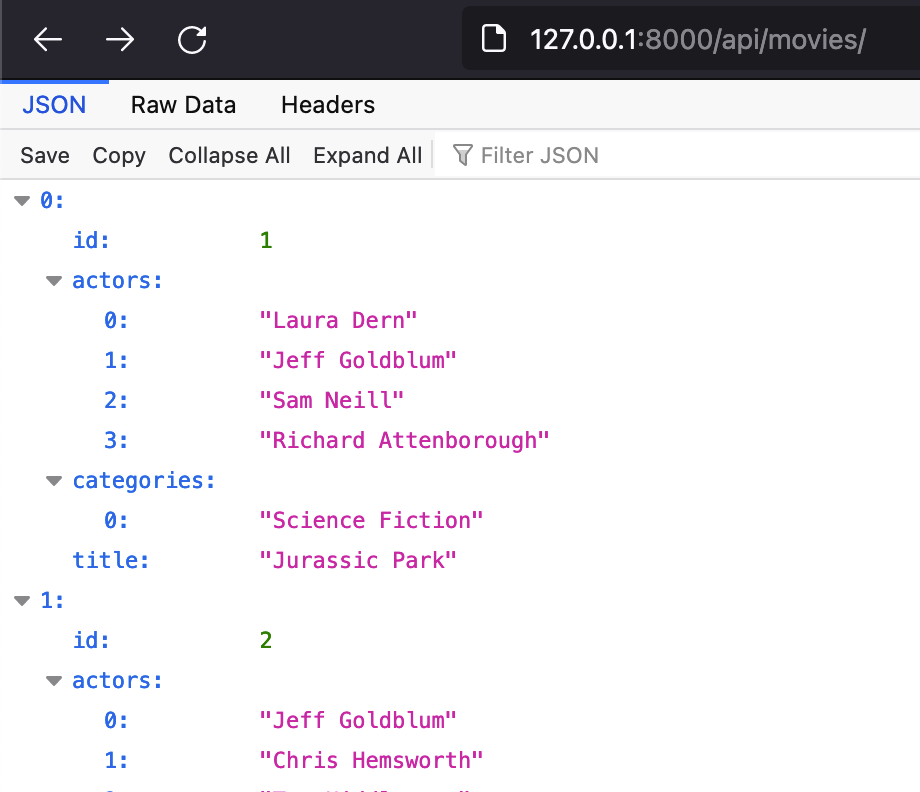
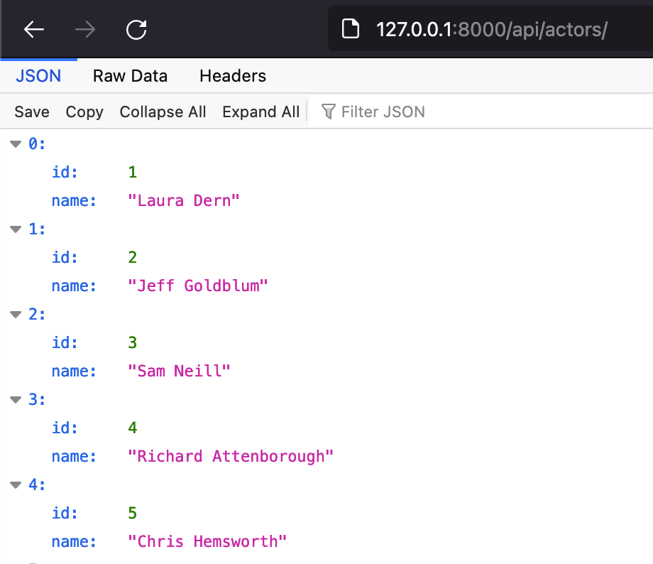
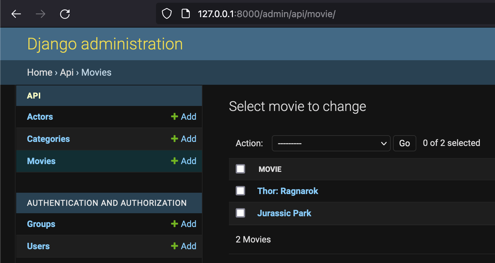

# Movies API
A simple python3 movies API using Django. 

### Movies Endpoint

/api/movies/

### Actors Endpoint

/api/actors/

### Django Admin Site

/api/admin/

## Usage
- cd into the movieapi directory
- run `python3 manage.py runserver`
- visit `http://127.0.0.1:8000/`
- Update data using the admin interface at /api/admin
